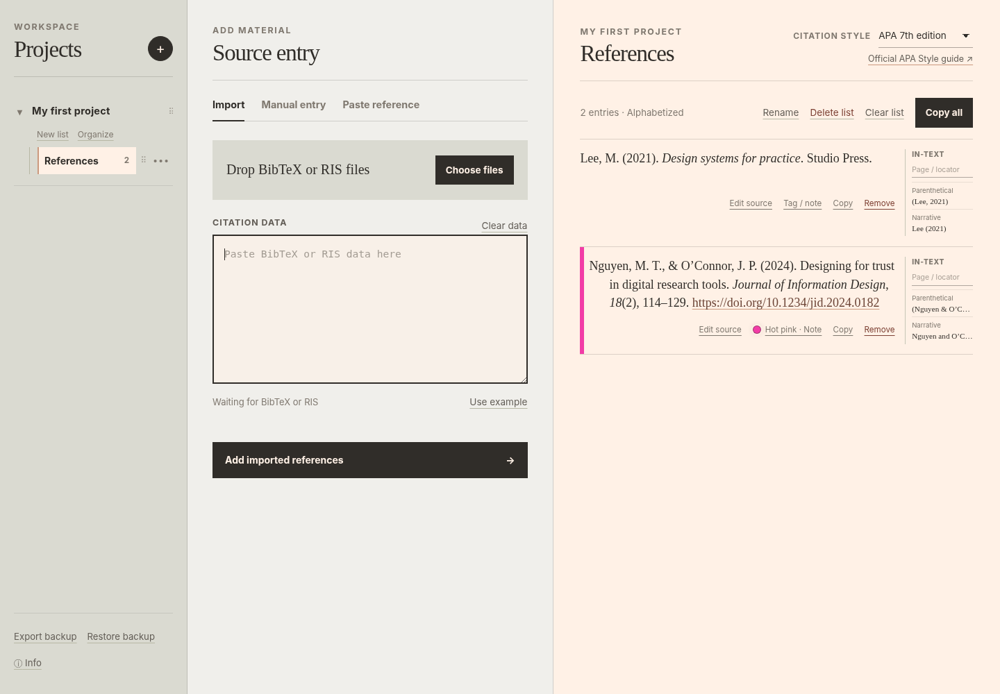

# Reference Studio

Reference Studio is a free citation workspace that runs entirely in a web browser. It imports, creates, organizes, and copies APA 7 and UNSW Harvard references without an account, installation, build step, or citation-data upload.

**[Open Reference Studio →](https://fatfreejoy.github.io/Reference-Studio/)**

Created by [FatfreeJoy](https://github.com/FatfreeJoy) · [Report a bug or suggest an improvement](https://github.com/FatfreeJoy/Reference-Studio/issues/new/choose)



## Use Reference Studio

### Open it online

Launch the [GitHub Pages version](https://fatfreejoy.github.io/Reference-Studio/) and choose **Start** on the welcome screen.

### Run it locally

1. Download or clone this repository.
2. Open `index.html` in a current browser.
3. Choose **Start** on the welcome screen.

## Features

- APA 7th edition and UNSW Harvard reference formatting
- Parenthetical and narrative in-text citations with optional locators
- BibTeX and RIS import, including multiple files
- Manual entry for journal articles, webpages, books, and book chapters
- Plain-text entry for completed references
- Structured editing for supported manual-entry types
- Multiple projects and reference lists
- List reordering, duplication, and transfer between projects
- Nine named color tags and private notes
- Undo after removing one reference
- Local automatic saving
- JSON workspace backup and restore

## Entry methods

### Import

Drop or choose BibTeX or RIS files, or paste their contents. Reference Studio detects the format from the content and skips duplicate DOI, URL, formatted-text, or equivalent metadata records within the active list.

### Manual entry

The form supports journal articles, webpages, books, and book chapters. Use **Last name or group** for an organization author. Supported structured records can later be corrected with **Edit source**.

### Paste reference

Paste completed references separated by blank lines. These entries remain plain text and do not change when the list's citation style changes.

## Data and backups

Reference Studio stores one current workspace in browser storage. It does not keep a settings or workspace history. Clearing browser data, changing browsers, or losing a device can remove the workspace.

Use **Export backup** for important work. Backup files are unencrypted JSON containing project names, references, tags, and notes.

Restore accepts only the current Reference Studio backup format and replaces the current workspace after confirmation.

## Citation accuracy

The current styles are:

- [APA 7th edition](https://apastyle.apa.org/)
- [Harvard — UNSW](https://www.unsw.edu.au/student/managing-your-studies/academic-skills-support/toolkit/referencing/harvard)

Review imported metadata and generated output against the original source and the guide required by your institution. Harvard referencing varies by institution. This project is not affiliated with the American Psychological Association or UNSW Sydney.

## Browser support

Use a current version of Chrome, Edge, Firefox, or Safari. Clipboard behavior from a local `file://` page varies by browser; the application includes a plain-text fallback.

## Development

The project uses dependency-free HTML, CSS, and JavaScript. Run the smoke tests with:

```text
node tests/run-tests.js
```

Key files:

- `index.html` — interface markup
- `styles.css` — responsive visual design
- `citation-core.js` — parsing, normalization, and citation formatting
- `workspace-core.js` — current-schema workspace operations
- `app.js` — rendering, forms, storage, backups, and interactions
- `samples/` — small BibTeX and RIS examples
- `tests/` — dependency-free Node tests
- `.github/ISSUE_TEMPLATE/` — feedback forms

## License

Reference Studio is available under the [MIT License](LICENSE).
